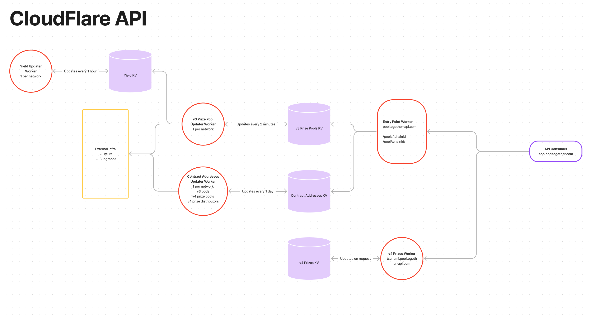

# `PoolTogether API Monorepo`

PoolTogether API Monorepo uses [CloudFlare workers](https://workers.cloudflare.com/) to build a minimal global API for use by PoolTogether integrators.

## Endpoints

> NOTE: Not all Prize Pools are supported. Only a select set of PoolTogether managed Prize Pools are available through the API.

> NOTE: Workers in the same DNS Zones cannot make requests to each other. So we break apart the workers into different zones if need be.

### pooltogether-api.com

v3 - Data

- `GET /pools/:chainId/:poolAddress`
- `GET /pools/:chainId`
- `GET /pods/:chainId/:podAddress`
- `GET /pods/:chainId`

v3 - Contract addresses

- `GET /v3/addresses/prize-pools/:chainId`
- `GET /v3/addresses/prize-pools/:chainId/:prizePoolAddress`

v4 - Contract addresses

- `GET /v4/addresses/prize-pools/:chainId`
- `GET /v4/addresses/prize-pools/:chainId/:prizePoolAddress`
- `GET /v4/addresses/prize-distributors/:chainId`
- `GET /v4/addresses/prize-distributors/:chainId/:prizeDistributorAddress`

Meta

- `GET /gas/:chainId`
- `GET /gas/update`

### yield.pooltogether.com

- `GET /:yieldSource`
- `GET /update`

### tsunami.pooltogether.com

- `GET /:chainId/:prizeDistributorAddress/prizes/:usersAddress/:drawId`

### pooltogether-api.workers.dev

v3 Prize Pools

- `GET {:network}-pool-updater.pooltogether-api.workers.dev/update`

v3 Pod Addresses

- `GET {:network}-contract-addresses-updater.pooltogether-api.workers.dev/pods/update`

v3 Prize Pool Addresses

- `GET {:network}-contract-addresses-updater.pooltogether-api.workers.dev/v3/prize-pools/update`

v4 Prize Pool Addresses

- `GET {:network}-contract-addresses-updater.pooltogether-api.workers.dev/v4/prize-pools/update`

v4 Prize Distributor Addresses

- `GET {:network}-contract-addresses-updater.pooltogether-api.workers.dev/v4/prize-distributors/update`

## Architecture

[Architecture overview](https://www.figma.com/file/btXwla206pJ0qIuDYmV1tO/CloudFlare-API)

A common pattern we use is to have an "updater" worker that runs on a set interval to refresh data frequently for a KV. This is paired with a function or two in [`entrypoint`](./workers/entrypoint/README.md) which expose the data from the KV.

> NOTE: Workers on the same zones cannot make requests to each other.

## Instructions

#### Installation

1. `yarn global add @cloudflare/wrangler` and then log in `wrangler login`

#### Setup Existing Workers

To run a worker locally from [workers](./workers), you will need to:

1. run: `cp wrangler.toml.example wrangler.toml` and fill out `account_id` & other related variables inside wrangler.toml
2. run: `yarn`

#### Creating A New Worker

To create a new worker you can generate a new one using (CloudFlares templates)[https://developers.cloudflare.com/workers/get-started/quickstarts/] or copy pasta an existing PT Worker. ([contract-address-updater](./workers/contract-address-updater/README.md)) and ([tsunami-prizes](./workers/tsunami-prizes/README.md)) are more modern examples.

1. run: `cp wrangler.toml.example wrangler.toml` and fill out `account_id` & other related variables inside wrangler.toml
2. run: `yarn`

#### Development ([pool-updater](./workers/api-pool-updater/README.md))

1. In `packages/api-runner` run: `yarn build`
2. In `packages/api-runner` run: `yalc push`
3. In `packages/api-pool-updater` run: `yalc link "@pooltogether/api-runner"`
4. In `packages/api-pool-updater` run: `yarn dev mainnet`
5. In `packages/api-entrypoint` run: `yarn dev --port 8888`

- `http://127.0.0.1:8787/update` to refresh the cache
- `http://127.0.0.1:8888/pools/1` to fetch all pools on mainnet

Updated values will be reflected in the development KV on Cloudflare.

#### Development ([entrypoint](./workers/api-entrypoint/README.md))

1. In `packages/api-entrypoint` run: `yarn dev-prod`
2. API is available at `http://127.0.0.1:8787/`

#### Development `[api-runner](./packages/api-runner/README.md)` Workflow

1. In `packages/api-runner` run: `yarn build`
2. In `packages/api-runner` run: `yalc push`
3. In `packages/X` run: `yalc link "@pooltogether/api-runner"`
4. In `packages/X` run: `yarn dev mainnet`
5. In `packages/api-entrypoint` run: `yarn dev --port 8888`

- `http://127.0.0.1:8787/update` to refresh the cache
- `http://127.0.0.1:8888/pools/1` to fetch all pools on mainnet

#### Development ([api-runner](./workers/api-runner/README.md))

It's handy to be able to run it in the node REPL, as the Cloudflare worker environment is Rust emulating JS which proves difficult for debugging.

It's set up to be identical to the other libraries we create and use, being built independently with Rollup and then consumed by the pool updater.

1. To run in dev mode, `cd packages/api-entrypoint` and run: `yarn start`
2. To publish to production, `cd packages/api-entrypoint` and run `wrangler publish`
3. To test the functionality:

- `cd packages/api-runner`
- `yarn build`
- `node`
- `const { pool, pools } = require( './dist/index')`
- `pool({ url: 'https://example.com/pools/1/0xEBfb47A7ad0FD6e57323C8A42B2E5A6a4F68fc1a.json' })`

#### Publishing

- [Publishing @pooltogether/api-runner](./packages/api-runner/README.md)
- [Publishing API Entry point](./workers/api-entrypoint/README.md#deploying)
- [Publishing Pool Updaters](./workers/api-pool-updater/README.md#deploying-a-single-network)
- [Publishing Yield Source Data](./workers/api-pool-updater/README.md#deploying)

